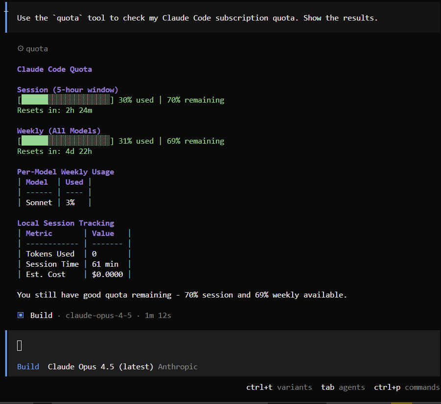

# OpenCode Claude Quota Plugin

A plugin for [OpenCode](https://github.com/sst/opencode) that displays your **real Claude.ai subscription quota** with progress bars.



## Features

- **Real quota from Claude.ai** - Fetches actual session (5-hour) and weekly (7-day) usage
- **Visual progress bars** - Shows usage at a glance
- **CLI tool included** - Check quota from terminal without OpenCode
- **Local session tracking** - Also tracks tokens in current session

## Requirements

- [OpenCode](https://github.com/sst/opencode) with Claude OAuth authentication
- Claude Pro or Max subscription
- Node.js >= 18

## Installation

### Option 1: Plugin (for OpenCode)

Copy the plugin file to your OpenCode project:

```bash
# Clone this repo
git clone https://github.com/nguyenngothuong/opencode-claude-quota.git

# Copy to your project's plugin directory
mkdir -p .opencode/plugin
cp opencode-claude-quota/src/index.ts .opencode/plugin/claude-quota.ts
```

Or install globally for all projects:

```bash
# Linux/macOS
mkdir -p ~/.config/opencode/plugin
cp src/index.ts ~/.config/opencode/plugin/claude-quota.ts

# Windows (PowerShell)
mkdir -Force "$env:USERPROFILE\.config\opencode\plugin"
copy src\index.ts "$env:USERPROFILE\.config\opencode\plugin\claude-quota.ts"
```

### Option 2: CLI only (npm)

```bash
# Install globally
npm install -g opencode-claude-quota

# Or run directly with npx
npx opencode-claude-quota
```

## Usage

### In OpenCode

Use the `/quota` command or ask the assistant:

```
/quota
```

or

```
check my quota
```

**Example output:**

```markdown
## Claude Code Quota (from Claude.ai)

### Session (5-hour window)
[██░░░░░░░░░░░░░░░░░░] **8%** used | **92%** remaining
Resets in: 3h 58m

### Weekly (All Models)
[██████░░░░░░░░░░░░░░] **28%** used | **72%** remaining
Resets in: 5d 0h

### Local Session Tracking
| Metric | Value |
|--------|-------|
| Tokens Used | 15,234 |
| Requests | 12 |
| Session Time | 45 min |
| Est. Cost | $0.0234 |
```

### CLI (Terminal)

```bash
# If installed globally
claude-quota

# Or with npx
npx opencode-claude-quota

# Or run directly
node bin/cli.mjs
```

**CLI output:**

```
╔════════════════════════════════════════╗
║      CLAUDE CODE QUOTA STATUS          ║
╚════════════════════════════════════════╝

📊 SESSION (5-hour window)
   [██░░░░░░░░░░░░░░░░░░] 8% used
   Remaining: 92%  Resets in: 3h 58m

📈 WEEKLY (7-day rolling)
   [██████░░░░░░░░░░░░░░] 28% used
   Remaining: 72%  Resets in: 5d 0h

──────────────────────────────────────────
   Fetched at: 8:15:30 PM
```

## Available Tools

| Tool | Description |
|------|-------------|
| `quota` | Check Claude.ai quota with progress bars |
| `quotaReset` | Reset local session token counters |

## How It Works

### Architecture: 3 Independent Components

```
┌─────────────────────────────────────────────────────────────┐
│                    opencode-claude-quota                    │
├─────────────────────────────────────────────────────────────┤
│                                                             │
│  1. PLUGIN (.opencode/plugin/claude-quota.ts)               │
│     └── Registers TOOL "quota" with OpenCode                │
│         └── LLM calls this tool when user asks about quota  │
│                                                             │
│  2. COMMAND (.opencode/command/quota.md)                    │
│     └── Slash command /quota                                │
│         └── Just a prompt: "check my Claude quota"          │
│         └── Triggers LLM → LLM calls quota tool             │
│                                                             │
│  3. CLI (bin/cli.mjs)                                       │
│     └── Runs standalone from terminal                       │
│         └── No OpenCode required                            │
│                                                             │
└─────────────────────────────────────────────────────────────┘
```

### Flow

```
User types "/quota" or "check my quota"
        │
        ▼
┌───────────────────┐
│  OpenCode (LLM)   │
│  Claude/Gemini    │
└────────┬──────────┘
         │ LLM decides to call "quota" tool
         ▼
┌───────────────────┐
│  PLUGIN           │
│  claude-quota.ts  │
└────────┬──────────┘
         │ 1. Read auth.json (get access_token)
         │ 2. Call Claude API: /api/oauth/usage
         │ 3. Format result with progress bars
         ▼
┌───────────────────┐
│  Return markdown  │
│  display to user  │
└───────────────────┘
```

### Component Summary

| Component | File | Function |
|-----------|------|----------|
| **Plugin** | `claude-quota.ts` | Registers tool `quota` - LLM can call it |
| **Command** | `quota.md` | Shortcut `/quota` → triggers LLM to ask about quota |
| **CLI** | `cli.mjs` | Standalone terminal tool, no OpenCode needed |

### Key Points

- **Plugin** = registers a **tool** for LLM to use
- **Command** = just a **prompt template**, no logic
- **CLI** = **standalone**, copies logic from plugin

When you type `/quota`:
1. Command sends prompt "check quota" to LLM
2. LLM sees tool `quota` available → calls tool
3. Plugin runs, fetches API, returns result

### Auth File Locations

The plugin searches for `auth.json` in these locations:

| Platform | Path |
|----------|------|
| Linux/macOS | `~/.local/share/opencode/auth.json` |
| Windows | `%LOCALAPPDATA%\opencode\auth.json` |
| XDG | `$XDG_DATA_HOME/opencode/auth.json` |

## API Response Format

The plugin expects this response from Claude's OAuth usage API:

```json
{
  "five_hour": {
    "utilization": 8.0,
    "resets_at": "2025-01-20T16:59:59.631252+00:00"
  },
  "seven_day": {
    "utilization": 28.0,
    "resets_at": "2025-01-25T12:59:59.631274+00:00"
  },
  "seven_day_sonnet": {
    "utilization": 3.0
  }
}
```

> Note: `utilization` is a percentage (0-100).

## Troubleshooting

### "Could not fetch quota from Claude.ai"

- Make sure you're logged in with Claude Pro/Max via OAuth in OpenCode
- Check that `auth.json` exists and contains `anthropic.type: "oauth"`
- Token might be expired - restart OpenCode to refresh

### "API Error: 401"

- Access token expired
- Restart OpenCode to get a new token

### Plugin not loading

- Check OpenCode logs for `[claude-quota]` messages
- Ensure file is in `.opencode/plugin/` or `~/.config/opencode/plugin/`
- Restart OpenCode after adding the plugin

## Project Structure

```
opencode-claude-quota/
├── src/
│   └── index.ts      # OpenCode plugin
├── bin/
│   └── cli.mjs       # CLI tool
├── package.json
├── LICENSE
└── README.md
```

## Contributing

```bash
git clone https://github.com/nguyenngothuong/opencode-claude-quota.git
cd opencode-claude-quota

# Make changes to src/index.ts (plugin) or bin/cli.mjs (CLI)
# Test by copying to .opencode/plugin/
```

## Related

- [OpenCode](https://github.com/sst/opencode) - AI coding assistant
- [Claude](https://claude.ai) - Anthropic's AI assistant

## License

MIT
